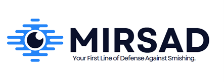

# MIRSAD

<picture align="center"></picture>

##  About MIRSAD

Mirsad is an Android mobile application designed for people who want to protect themselves from fraudulent text messages and Smishing attacks. Developed using flutter framework, the app helps users distinguish between legitimate and fraudulent text messages and supports English as its primary language. The app is specifically intended for use with text messages written in the English language. User manually enters the text message, and Mirsad then classifies them as either fraudulent or legitimate. The app includes an AI assistant that provides help with frequently asked questions (FAQ) and introduces users to Mirsad's features. This assistant guides users on how to use the app and provides explanations about its functionalities, also users can report any suspicious text messages they receive and suspect that it is fraud.  

 Mirsad provides percentage feedback on the messages. Also, the app offers an analytical report feature based on the messages classified as fraudulent and reported by the users. The analytical reports are available on a weekly, monthly, and annual basis, providing insights into the reported messages. Additionally, a detailed justification to help better understand the meaning behind how that percentage was assigned and to gain more insights.
 
## Tools and Programming Languages:

•	Flutter.
•	Visual Studio Code.
•	Python.
•	Git, GitHub.
•	Jira.
•	Android studio.
•	Canva.
***

